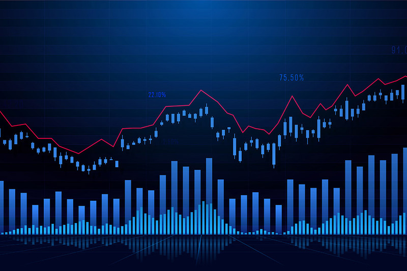
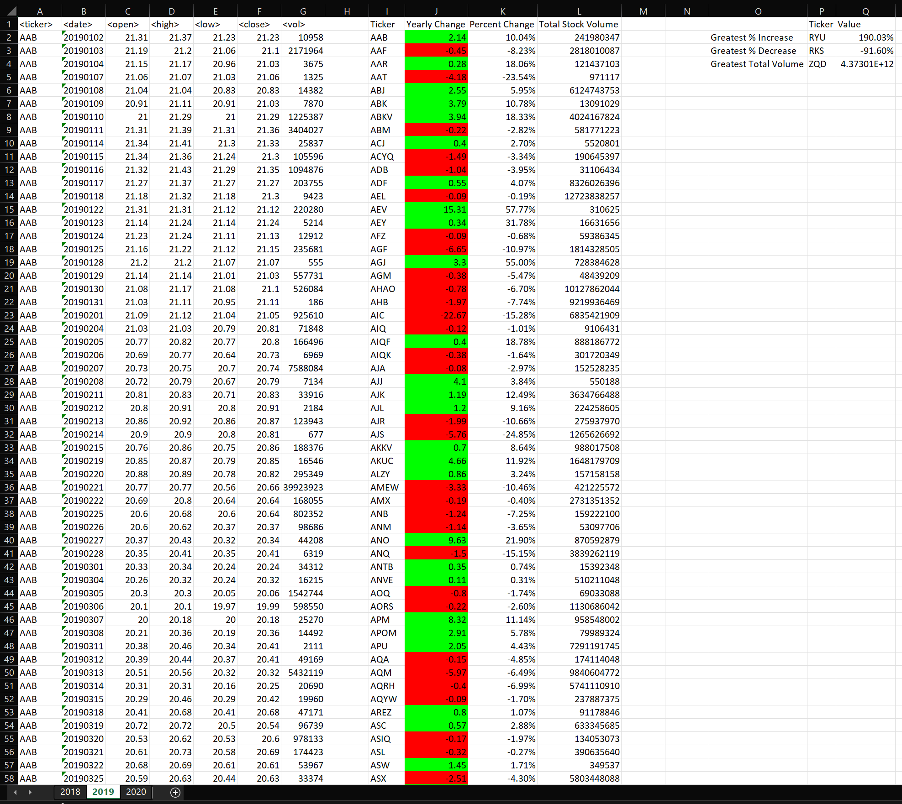

# VBA-StockMarketAnalysis

## Summary
The VBA-StockMarketAnalysis project aims to solve the problem of automating stock data analysis using Visual Basic for Applications (VBA) in Excel. The project involves developing a VBA script that iterates through stock data and generates an output report. The script provides information such as the ticker symbol, yearly change, percentage change, and total stock volume for each stock.

## Introduction
This Analytical exercise is centered on developing a VBA script that iterates through stock data and generates an output report. The task involved creating a new repository named VBA-StockMarketAnalysis, reading the stock_data.xlsx file, and designing the script to provide the following information:

- The ticker symbol
- Yearly change from the opening price at the start of a specific year to the closing price at the end of that year
- The percentage change from the opening price at the beginning of a given year to the closing price at the end of that year
- The total stock volume of the stock

Here is an example of the output generated by the VBA script:

## Additional Task:
The task also involved incorporating a feature into the script to return the stock with the "Greatest % increase", "Greatest % decrease", and "Greatest total volume".

## Conclusion
This project provided an opportunity to leverage VBA and automate stock data analysis. Despite encountering some challenges along the way, the overall experience was valuable in harnessing the power of VBA for financial analysis.

## Tools
- Excel
- Visual Basic for Applications (VBA)

## File
- [VBA Script](./VBA_Of_Wall_Street_Anush_Final1.vb)
- [Alphabetical testing images](./Images/Alphabetical_Testing)
- [Year based testing images](./Images/Multiple_year_stock_data)

